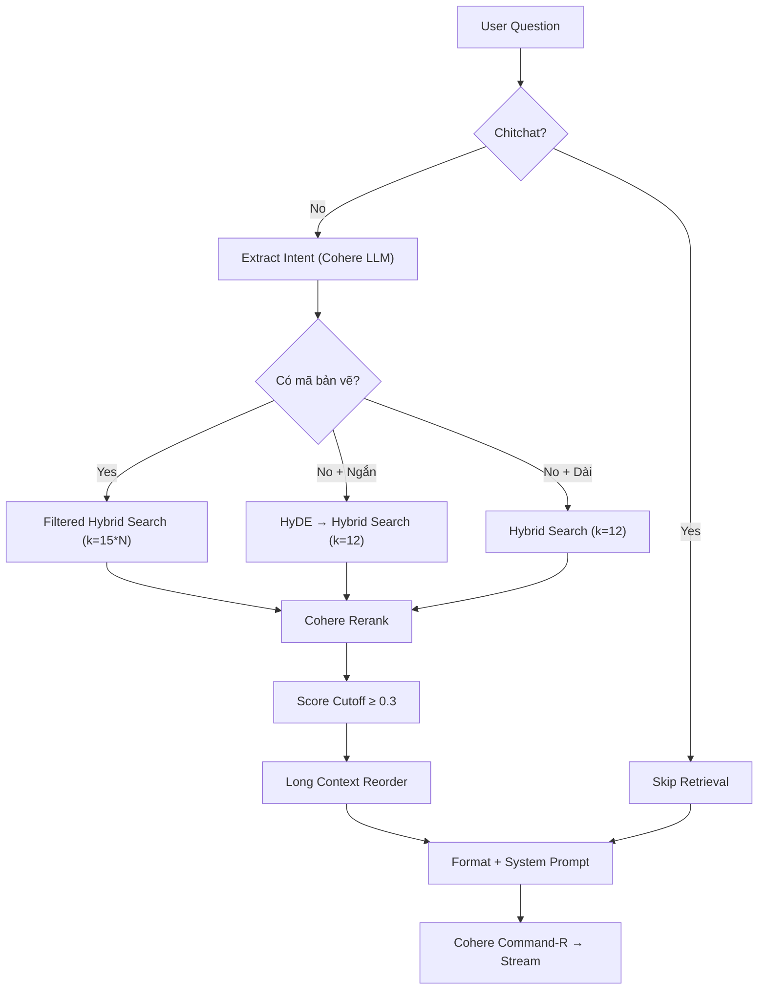

# 🔍 BÁO CÁO ĐÁNH GIÁ TOÀN DIỆN - ChatBot RAG Cơ Khí

> [!NOTE]
> Đánh giá dựa trên việc đọc kỹ toàn bộ 9 file source code, SQL schema, .env, và cấu hình Streamlit.

---

## MỤC LỤC
1. [Lỗi Nghiêm Trọng (CRITICAL)](#1-lỗi-nghiêm-trọng-critical)
2. [Bugs Tiềm Ẩn (HIGH)](#2-bugs-tiềm-ẩn-high)
3. [Điểm Cần Cải Thiện (MEDIUM)](#3-điểm-cần-cải-thiện-medium)
4. [Đánh Giá Logic RAG Pipeline](#4-đánh-giá-logic-rag-pipeline)
5. [Lộ Trình Demo → Enterprise](#5-lộ-trình-demo--enterprise)

---

## 1. Lỗi Nghiêm Trọng (CRITICAL)

### 🔴 C1: API Keys bị lộ trực tiếp trong `.env` — KHÔNG CÓ BẢO VỆ

**File:** [.env](file:///c:/Users/bao.nguyen/Documents/ChatBotProject/.env#L15-L27)

Mặc dù `.env` đã nằm trong `.gitignore`, nhưng:
- Key `GOOGLE_API_KEY` và `COHERE_API_KEY` để nguyên giá trị thật trong file
- **Không có cơ chế rotation** — nếu key bị lộ, phải sửa tay
- **Không có validation** khi key hết hạn/bị revoke → app crash không rõ nguyên nhân

**Rủi ro:** Nếu ai đó copy repo (kể cả qua USB), key bị lộ hoàn toàn.

---

### 🔴 C2: Race Condition trên `uploaded_image` — Crash khi user gửi text thuần

**File:** [app.py:318](file:///c:/Users/bao.nguyen/Documents/ChatBotProject/app.py#L318)

```python
uploaded_image = uploaded_files[0] if uploaded_files else None
```

Biến `uploaded_files` có thể là list rỗng `[]` (khi `submission.files` là `[]`). Code đã xử lý đúng ở đây. **Tuy nhiên**, ở dòng 324:

```python
st.session_state.chat_history.append({
    "role": "user",
    "content": prompt,
    "image": uploaded_image  # ← None hoặc UploadedFile object
})
```

Khi reload lịch sử (dòng 206-212), code kiểm tra `isinstance(img, str)` rồi `os.path.exists()`. Nhưng **`uploaded_image` lúc ban đầu là `UploadedFile` object, không phải string** → khi `st.rerun()`, Streamlit serialize session state, `UploadedFile` object **không thể serialize** → **lỗi hoặc mất ảnh**.

Sau `st.rerun()` ở dòng 418, `uploaded_image` trong history trở thành object đã bị invalidate → `st.image()` sẽ lỗi ở lần render tiếp.

**Fix:** Nên lưu `saved_img_path` (đã persist) thay vì `uploaded_image` object vào history user.

---

### 🔴 C3: Qdrant Local File Lock — Single-Process Bottleneck

**File:** [rag_logic.py:77](file:///c:/Users/bao.nguyen/Documents/ChatBotProject/rag_logic.py#L71-L77)

```python
client = QdrantClient(path=qdrant_path)  # File-based, SINGLE PROCESS ONLY
```

Qdrant local mode (`path=`) dùng **RocksDB file lock** — chỉ cho phép **1 process** truy cập. Nếu:
- Chạy 2 instance Streamlit → **crash ngay**
- Chạy `wipe_and_reingest.py` trong khi app đang chạy → **data corruption**
- Deploy nhiều worker (gunicorn/uvicorn) → **không hoạt động**

**Rủi ro:** Đây là blocker #1 cho enterprise deployment.

---

### 🔴 C4: `st.write_stream` + `_escape_md` — Double-Escape khi reload lịch sử

**File:** [app.py:205](file:///c:/Users/bao.nguyen/Documents/ChatBotProject/app.py#L203-L205) và [app.py:382](file:///c:/Users/bao.nguyen/Documents/ChatBotProject/app.py#L378-L393)

**Luồng ghi:**
1. Stream chunk → `_escape_md(chunk)` → hiển thị (dòng 382)
2. Lưu raw vào `raw_response` (dòng 391) → lưu DB (dòng 408) ✅ OK

**Luồng đọc lại:**
3. Load từ DB → `st.session_state.chat_history` → `st.markdown(_escape_md(msg["content"]))` (dòng 205)

**Vấn đề:** Bản raw từ DB có thể chứa markdown hợp lệ (`**bold**`, `| table |`). Khi `_escape_md()` chạy lần nữa, nó escape `&` trong nội dung → **hiển thị sai**. Ví dụ: `R&D` → lưu DB là `R&D` → đọc lại `_escape_md("R&D")` → hiển thị `R&amp;D`.

Nghiêm trọng hơn: `ref_text` chứa `**Nguồn tham chiếu:**` với markdown formatting. Khi reload, `_escape_md` sẽ **không escape `*`** (vì `quote=False`), nhưng nếu nội dung có `<tag>` → bị escape thành `&lt;tag&gt;`.

---

### 🔴 C5: `ref_images` mất khi reload session cũ

**File:** [db_logic.py:164](file:///c:/Users/bao.nguyen/Documents/ChatBotProject/db_logic.py#L156-L166)

```python
history.append({
    "role": "assistant",
    "content": row[2],
    "chat_id": row[0],
    "danh_gia": row[4],
    "ref_images": [],  # ← LUÔN RỖNG!
})
```

`ref_images` **không được lưu vào DB** → khi user chuyển sang session cũ rồi quay lại, tất cả "Bản vẽ căn cứ" đều **biến mất**. Đây là tính năng cốt lõi của chatbot kỹ thuật.

---

### 🔴 C6: SQL Injection tiềm ẩn — Đã dùng parameterized queries nhưng thiếu validation đầu vào

**File:** [db_logic.py](file:///c:/Users/bao.nguyen/Documents/ChatBotProject/db_logic.py)

Code đã dùng `text()` + parameters ✅. Tuy nhiên:
- `session_id` là UUID do client tạo (`str(uuid.uuid4())`) → OK
- `user_msg` và `bot_msg` là `NVARCHAR(MAX)` → **không có giới hạn size** → kẻ tấn công có thể gửi payload cực lớn (GB) làm DB sập
- Không có rate limiting → 1 user có thể spam hàng nghìn request/phút

---

## 2. Bugs Tiềm Ẩn (HIGH)

### 🟠 H1: Memory Leak — Embedding Model không bao giờ được giải phóng

**File:** [rag_logic.py:55-65](file:///c:/Users/bao.nguyen/Documents/ChatBotProject/rag_logic.py#L55-L65)

`RAGSystem` dùng Singleton pattern nhưng:
- `HuggingFaceEmbeddings` load model vào RAM (~500MB cho vietnamese-sbert)
- `FastEmbedSparse` (BM25) cũng load model
- Không có cơ chế `__del__` hay cleanup

Khi Streamlit rerun (mỗi lần user tương tác), module **không bị reload** → model giữ nguyên ✅. Nhưng nếu có lỗi partial init (exception giữa chừng), `_instance` vẫn là `None` → lần sau init lại → **leak model cũ**.

---

### 🟠 H2: `ThreadPoolExecutor` leak — Future không bị cancel khi timeout

**File:** [rag_logic.py:195-224](file:///c:/Users/bao.nguyen/Documents/ChatBotProject/rag_logic.py#L195-L234)

```python
future = _INTENT_EXECUTOR.submit(call_llm)
raw_response = future.result(timeout=_INTENT_TIMEOUT)
```

Khi timeout xảy ra:
1. `future.result()` raise `TimeoutError` ✅
2. Nhưng **`call_llm()` vẫn chạy ngầm** trong thread pool → thread bị chiếm
3. Với `max_workers=8`, sau 8 lần timeout liên tiếp → **thread pool cạn kiệt** → app đứng

**Fix cần thiết:** `future.cancel()` sau timeout (dù cancel chỉ hoạt động nếu task chưa bắt đầu).

---

### 🟠 H3: `pdfplumber` IndexError khi PDF bị corrupt

**File:** [pdf_processor.py:544](file:///c:/Users/bao.nguyen/Documents/ChatBotProject/pdf_processor.py#L542-L544)

```python
page_plumber = pdf_table_reader.pages[page_num]
```

Nếu `fitz` (PyMuPDF) đọc được N trang nhưng `pdfplumber` chỉ đọc được M trang (M < N) do corrupt → **IndexError**.

---

### 🟠 H4: HyDE gọi LLM thừa — Double LLM call cho mỗi câu hỏi kỹ thuật ngắn

**File:** [rag_logic.py:373-381](file:///c:/Users/bao.nguyen/Documents/ChatBotProject/rag_logic.py#L370-L381)

Luồng cho câu hỏi kỹ thuật ngắn không có mã:
1. `extract_search_intent()` → gọi Cohere LLM 1 lần
2. HyDE trigger → gọi Cohere LLM lần 2
3. Cohere Rerank → gọi API lần 3
4. Final answer → gọi Cohere LLM lần 4

**Tổng: 4 API calls** cho 1 câu hỏi. Với Cohere Free Tier (giới hạn calls/phút), dễ bị rate limit.

---

### 🟠 H5: `underthesea.word_tokenize` chậm — Không có cache

**File:** [pdf_processor.py:587](file:///c:/Users/bao.nguyen/Documents/ChatBotProject/pdf_processor.py#L585-L587) và [rag_logic.py:367](file:///c:/Users/bao.nguyen/Documents/ChatBotProject/rag_logic.py#L367)

Mỗi chunk đều gọi `underthesea.word_tokenize()` — hàm này **rất chậm** (50-200ms/call). Với 1 PDF 10 trang, mỗi trang 5-10 chunks = 50-100 calls = **5-20 giây chỉ cho tokenization**.

---

### 🟠 H6: `Rerank Score Cutoff 0.3` quá cứng nhắc

**File:** [rag_logic.py:448](file:///c:/Users/bao.nguyen/Documents/ChatBotProject/rag_logic.py#L446-L451)

```python
real_docs = [doc for doc in compressed_docs if doc.metadata.get("relevance_score", 1.0) >= 0.3]
```

Ngưỡng 0.3 là **hardcoded**. Với câu hỏi chung chung ("vật liệu gì?"), nhiều tài liệu liên quan có thể score < 0.3 → bị loại bỏ hết → bot trả lời "không tìm thấy" dù dữ liệu có trong DB.

---

### 🟠 H7: Không handle khi Cohere API key hết free tier

Cohere Free Tier giới hạn:
- 10 requests/phút cho Chat
- 100 requests/phút cho Rerank

Khi vượt → `429 Too Many Requests`. Code `rag_logic.py` **không có retry cho Cohere** (chỉ có retry cho Gemini).

---

### 🟠 H8: `chat_history` trong session state — Không giới hạn kích thước

**File:** [app.py:47](file:///c:/Users/bao.nguyen/Documents/ChatBotProject/app.py#L46-L47)

```python
if "chat_history" not in st.session_state:
    st.session_state.chat_history = []
```

List này **grow vô hạn** trong 1 session. Sau 100+ tin nhắn:
- RAM tăng (mỗi message có thể chứa base64 image)
- Streamlit serialize chậm
- `history_for_rag = st.session_state.chat_history[:-1]` truyền toàn bộ qua function call

---

## 3. Điểm Cần Cải Thiện (MEDIUM)

| # | Vấn đề | File | Mô tả |
|---|--------|------|-------|
| M1 | **Regex quá cứng** | `pdf_processor.py:103-122` | Chỉ match `9.3.xxxxx` và `8.3.xxxxx.xxx`. Tài liệu ISO, catalog, manual sẽ không extract được mã |
| M2 | **Không có `requirements.txt`** | Project root | Không thấy file quản lý dependencies → deploy khó lặp lại |
| M3 | **Thiếu health check endpoint** | — | Không có cách kiểm tra app còn sống hay DB đã mất kết nối |
| M4 | **`wipe_and_reingest.py` không xóa `Data_Anh_Da_Tach`** | `wipe_and_reingest.py` | Xóa Qdrant + SQL nhưng **không xóa ảnh đã tách** → ảnh cũ orphaned |
| M5 | **CSS hardcode dark mode** | `app.py:175-199` | Dùng `#2b2b36`, `#1e1e26` hardcode → nếu user dùng light theme Streamlit sẽ xấu |
| M6 | **Chitchat detection quá đơn giản** | `rag_logic.py:344-346` | Dùng exact match set → "xin chào bạn nhé" không match vì có thêm "nhé" |
| M7 | **Không log request latency** | `rag_logic.py` | Không đo thời gian từng bước (intent, retrieval, rerank, LLM) → khó debug bottleneck |
| M8 | **`image_path` trong `chat_history` không persist** | `app.py:321-324` | User message lưu `uploaded_image` (UploadedFile object) thay vì path string |
| M9 | **Thiếu backup strategy cho Qdrant local** | — | Nếu folder `Mechanical_Qdrant_DB` bị xóa/corrupt → mất toàn bộ vector data |
| M10 | **SQL schema thiếu index trên `TaiLieu.TenFile`** | `Mech_Chatbot_DB.sql` | Query `WHERE TenFile = :f AND ThuMuc = :t` không có index → slow khi nhiều files |

---

## 4. Đánh Giá Logic RAG Pipeline

### Tổng quan luồng hoạt động



### ✅ Điểm tốt

| Aspect | Đánh giá |
|--------|----------|
| **Hybrid Search** (Dense + Sparse) | Tốt — kết hợp semantic similarity + BM25 keyword matching |
| **HyDE** cho câu hỏi ngắn | Sáng tạo — mở rộng ngữ cảnh khi query quá ngắn |
| **Cohere Rerank** | Đúng best practice — cross-encoder rerank tăng precision |
| **Long Context Reorder** | Đúng paper "Lost in the Middle" — xen kẽ doc quan trọng |
| **State Memory** (`current_part_ids`) | Giữ context mã bản vẽ qua nhiều turn — UX tốt |
| **Document Versioning** (xóa vector cũ trước khi add) | Tránh duplicate data |
| **Token-based chunking** (480 tokens, 80 overlap) | Phù hợp với model embedding 512 max tokens |
| **Dual content** (`noi_dung_goc` + tokenized `page_content`) | Giải quyết mismatch giữa BM25 tokenize vs LLM cần text gốc |

### ⚠️ Điểm cần cải thiện trong RAG logic

| Vấn đề | Giải thích |
|--------|-----------|
| **Intent Extraction dùng LLM quá tốn kém** | Mỗi câu hỏi đều gọi Cohere LLM chỉ để extract mã. Nên dùng **Regex trước → LLM fallback** giống `extract_metadata_smart` |
| **Asymmetric Windowing chỉ cắt theo ký tự** | Cắt ở 300 chars → có thể cắt giữa bảng Markdown → LLM nhận context bị vỡ |
| **Rerank `top_n` tính sai khi `new_part_ids=None`** | Dòng 439: `len(new_part_ids)` khi `new_part_ids=None` → crash. Thực tế code đã handle bằng `if new_part_ids else 1` nhưng logic phức tạp dễ sai |
| **Fallback search không reset `query_to_search`** | Dòng 410-414: fallback dùng `query_to_search` đã qua HyDE → search kết quả sai |
| **Thiếu Semantic Cache** | Câu hỏi giống nhau gọi lại toàn bộ pipeline (4 API calls). Cache kết quả sẽ tiết kiệm đáng kể |

---

## 5. Lộ Trình Demo → Enterprise

### Giai đoạn 1: Ổn định (1-2 tuần)

> Fix các lỗi CRITICAL và HIGH để app không crash trong production

- [ ] **Fix C2:** Lưu `saved_img_path` thay vì `uploaded_image` object vào user history
- [ ] **Fix C4:** Bỏ `_escape_md` khi render history (dùng `unsafe_allow_html=True` nếu cần)
- [ ] **Fix C5:** Lưu `ref_images` vào DB (thêm cột `RefImages NVARCHAR(MAX)` dạng JSON)
- [ ] **Fix H2:** Cancel future và log warning khi thread pool exhausted
- [ ] **Fix H3:** Wrap `pdf_table_reader.pages[page_num]` trong try/except
- [ ] Thêm `requirements.txt` với pinned versions
- [ ] Thêm input size validation (giới hạn `user_msg` ≤ 10000 chars)

### Giai đoạn 2: Enterprise-Ready (2-4 tuần)

> Chuyển từ local sang server, thêm bảo mật và monitoring

| Hạng mục | Hiện tại (Demo) | Cần làm (Enterprise) |
|----------|-----------------|---------------------|
| **Qdrant** | Local file-based (single process) | Qdrant Server (Docker) hoặc Qdrant Cloud |
| **Authentication** | Không có | SSO/LDAP integration hoặc Streamlit `st.login` |
| **API Key Management** | Hardcode trong `.env` | Azure Key Vault / AWS Secrets Manager |
| **Rate Limiting** | Không có | Middleware rate limit (10 req/user/phút) |
| **Monitoring** | File log (RotatingFileHandler) | ELK Stack / Grafana + Prometheus |
| **Backup** | Không có | Scheduled backup Qdrant snapshots + SQL backup |
| **CI/CD** | Không có | GitHub Actions: lint → test → deploy |
| **Error Tracking** | `logger.error()` | Sentry hoặc Application Insights |

### Giai đoạn 3: Scale (1-3 tháng)

> Mở rộng cho nhiều phòng ban, nhiều loại tài liệu

- [ ] **Multi-tenant:** Phân quyền theo phòng ban (metadata `phong_ban_quyen` đã có sẵn → tận dụng)
- [ ] **RBAC:** Admin upload tài liệu, User chỉ chat
- [ ] **Async Ingestion:** Dùng Celery + Redis để ingest file nền (không block UI)
- [ ] **Semantic Cache:** Redis cache cho câu hỏi tương tự (cosine similarity > 0.95)
- [ ] **Evaluation Pipeline:** Tự động đánh giá chất lượng RAG (RAGAS framework)
- [ ] **Versioned Collections:** Qdrant collection per version → rollback khi ingest sai
- [ ] **Observability:** Trace từng bước RAG (LangSmith hoặc Phoenix)
- [ ] **LLM Fallback:** Nếu Cohere down → tự chuyển sang Gemini làm LLM chính

---

## Tóm Tắt Nhanh

| Mức độ | Số lượng | Ảnh hưởng |
|--------|----------|-----------|
| 🔴 CRITICAL | 6 | App crash, data loss, bảo mật |
| 🟠 HIGH | 8 | Performance, memory leak, UX |
| 🟡 MEDIUM | 10 | Code quality, maintainability |

> [!IMPORTANT]
> **Ưu tiên fix ngay:** C2 (image crash), C3 (Qdrant lock), C5 (ref_images mất), và H7 (Cohere rate limit).
> RAG logic tổng thể đã **khá tốt cho demo** — Hybrid Search + Rerank + HyDE là đúng hướng.
> Bottleneck lớn nhất để lên enterprise là **Qdrant local file lock** và **thiếu authentication**.
